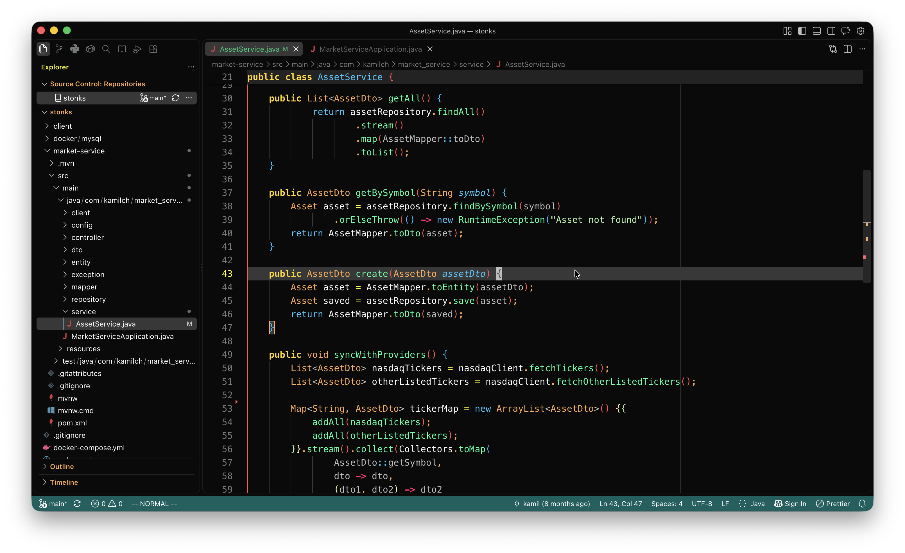

# Citruszest for VS Code

A VS Code port of [citruszest.nvim](https://github.com/zootedb0t/citruszest.nvim) — bright,
juicy citrus colors. Includes a dark theme and a light theme.

# How to Install
1. Clone this repo
2. Move it to the VSCode extension directory
    -  Windows: `%USERPROFILE%\.vscode\extensions`
    -  macOS: `~/.vscode/extensions`
    -  Linux: `~/.vscode/extensions`
